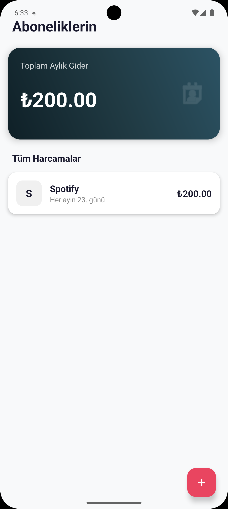
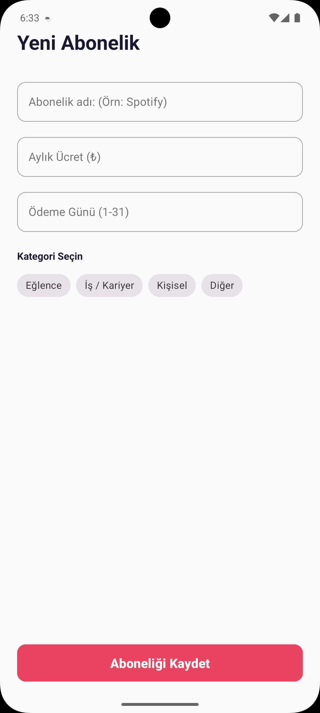
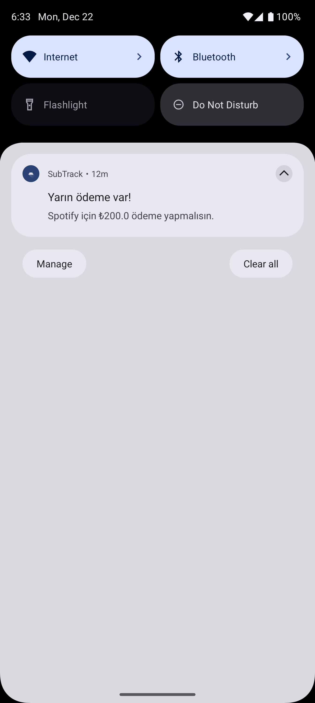

# SubTrack - Akıllı Abonelik ve Gider Yöneticisi 💳

   

**SubTrack**, kullanıcıların artan dijital aboneliklerini (Netflix, Spotify, Youtube vb.) tek bir yerden yönetmesini sağlayan, modern bir Android uygulamadır.

Bu proje; **Room Database** ile veri saklama, **WorkManager** ile arka plan işlemleri ve **MVVM** mimarisi gibi Modern Android Geliştirme yetkinliklerini sergilemek amacıyla geliştirilmiştir.

## 📱 Ekran Görüntüleri

<p align="center">
  
  
  
</p>

## 🔥 Temel Özellikler

* **📊 Anlık Gider Takibi:** Eklenen aboneliklere göre aylık toplam gideri anlık olarak hesaplar ve şık bir Dashboard üzerinde gösterir.
* **💾 Yerel Veritabanı (Room):** İnternet bağlantısına ihtiyaç duymadan verileri cihazda güvenle saklar.
* **🔔 Akıllı Bildirimler (WorkManager):** Uygulama kapalı olsa bile, ödeme günü **yarın** olan abonelikler için kullanıcıyı uyarır.
* **👆 Swipe-to-Delete (Kaydır Sil):** Listeden bir öğeyi silmek için sola kaydırma yapılabilir.
* **↩️ Geri Alma (Undo):** Yanlışlıkla silinen kayıtlar, Snackbar üzerinden tek dokunuşla geri getirilebilir.
* **🎨 Modern UI:** Custom Drawable'lar, Gradient arka planlar ve Material Design bileşenleri (Chips, TextInputLayout) kullanılarak tasarlanmıştır.

## 🛠️ Teknik Altyapı ve Kütüphaneler

Projede **Clean Architecture** ve **MVVM** prensiplerine sadık kalınmıştır.

* **Kotlin:** %100 Kotlin dili kullanıldı.
* **ViewBinding:** `findViewById` yerine Type-Safe görünüm erişimi sağlandı.
* **Room Database:** Veri kalıcılığı ve SQL işlemleri için.
* **Coroutines & Flow:** Asenkron işlemler ve reaktif veri akışı için.
* **WorkManager:** Periyodik arka plan görevleri ve zamanlanmış bildirimler için.
* **ListAdapter & DiffUtil:** RecyclerView performansını artırmak ve animasyonlu liste güncellemeleri için.
* **ViewModel & LiveData:** UI ve Data katmanını ayırmak, Configuration Changes (Ekran döndürme vb.) durumlarını yönetmek için.

## 📂 Proje Mimarisi

```text
com.berkar.subtrack
├── data
│   ├── db              # Room Entity, DAO ve Database sınıfı
│   └── repository      # Veri kaynağı yönetimi
├── ui
│   ├── adapter         # RecyclerView Adapter (DiffUtil & ListAdapter)
│   ├── view            # Activity'ler (MainActivity, AddSubscriptionActivity)
│   └── viewmodel       # İş mantığı (SubscriptionViewModel)
├── util
│   └── NotificationWorker.kt # Arka plan bildirim servisi
└── SubTrackApplication.kt    # Dependency Injection (Manuel)
